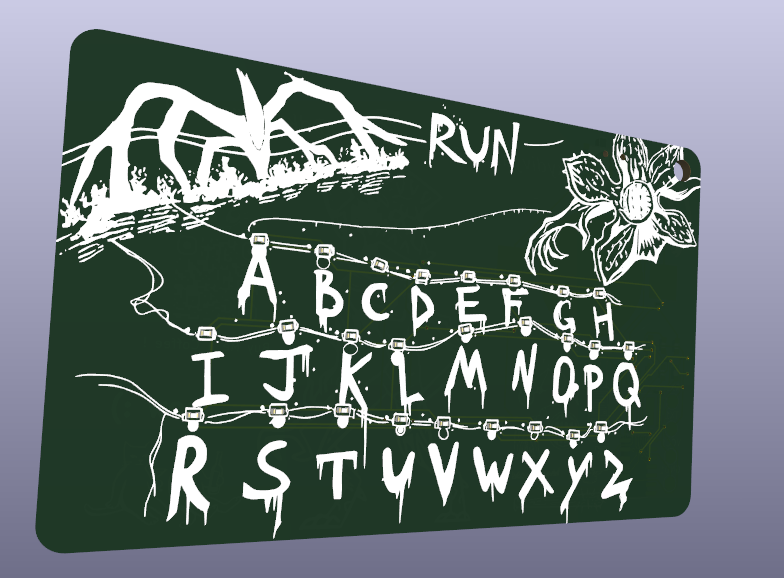
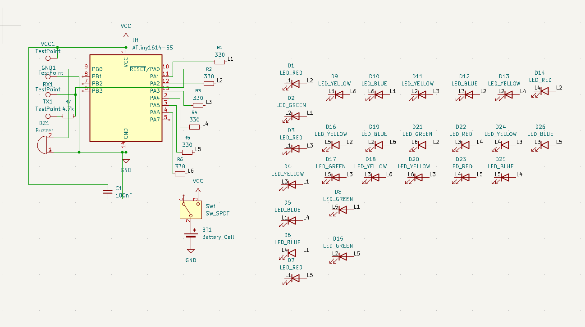
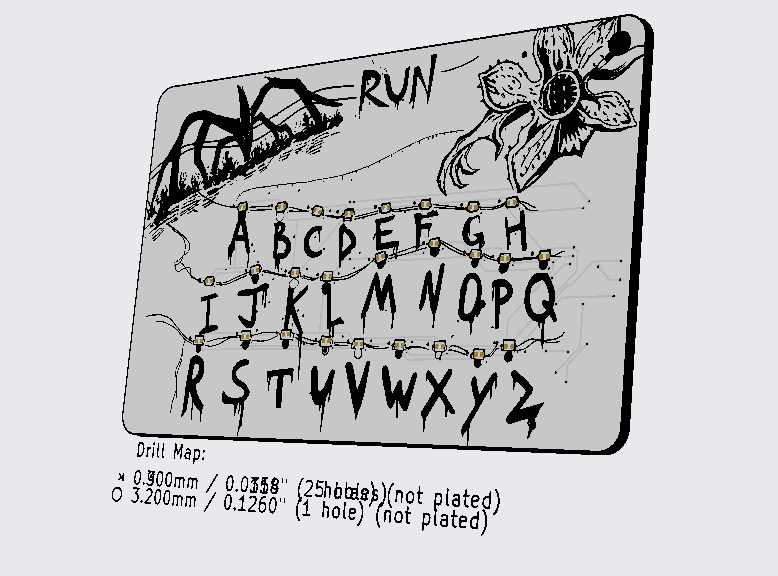
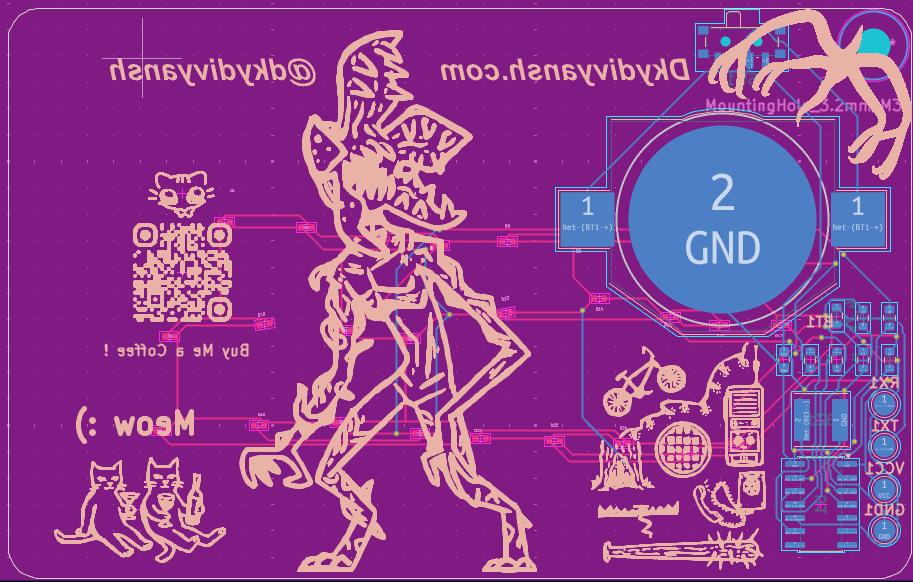

# The Upside Down: Stranger Things Alphabet Wall PCB Badge

*A functional artistic PCB tribute to the iconic communication method from Stranger Things.*

## About The Project

This project is a fusion of pop culture fandom and electronics engineering, manifesting as a custom-designed Printed Circuit Board (PCB) badge. It is a miniature, functional recreation of the "alphabet wall" used by Joyce Byers to communicate with the Upside Down in *Stranger Things*.

The PCB is not just a circuit carrier; it is the canvas. It features hand-drawn artwork rendered in black silkscreen on a white soldermask, depicting the A-Z alphabet, the towering Mind Flayer, and the Demogorgon flower. Underneath the art lies an embedded system capable of lighting up individual letters to spell out messages, just like in the show.

### Features

* **Artistic PCB Design:** Custom high-contrast silkscreen art serving as a collectible prop or wearable badge.
* **Full Alphabet Control:** 26 individually controllable LEDs corresponding to letters A-Z.
* **Integrated Sound:** A piezo buzzer for eerie sound effects and feedback.
* **Portable Power:** Runs on a compact battery cell with a simple on/off slide switch.
* **Efficient Circuitry:** Uses advanced multiplexing techniques to minimize component count.

## Hardware Overview

The heart of the badge is a modern, efficient 8-bit AVR microcontroller. Despite having a limited number of pins, the design controls 26 LEDs individually through a technique called Charlieplexing.

### Key Components

* **Microcontroller:** ATtiny1614-SS (U1).
* **LEDs:** 26x Surface Mount LEDs (Mixed colors: Red, Green, Blue, Yellow).
* **Audio:** Piezo Buzzer (BZ1).
* **Power:** Battery Cell (BT1) controlled by an SPDT slide switch (SW1).

### Schematic and Theory of Operation

Below is the schematic for the project.

**How Charlieplexing Works:**
To control 26 LEDs using only a small microcontroller, this design utilizes Charlieplexing. As seen in the schematic, 6 GPIO pins from the ATtiny1614 (PA1 through PA6) are connected to six lines (L1-L6) via 330-ohm current-limiting resistors (R1-R6).

The LEDs (D1-D26) are connected in opposing pairs across these lines. By rapidly switching the state of the microcontroller pins between High (VCC), Low (GND), and High-Impedance (Input), the firmware can target and illuminate any single LED at a time. By cycling through desired LEDs quickly, persistent vision creates the illusion that multiple lights are on simultaneously.

## Gallery

| Artistic Render | PCB Artwork |
| :---: | :---: |
|  |  |

## License
 GPL-3.0 license
